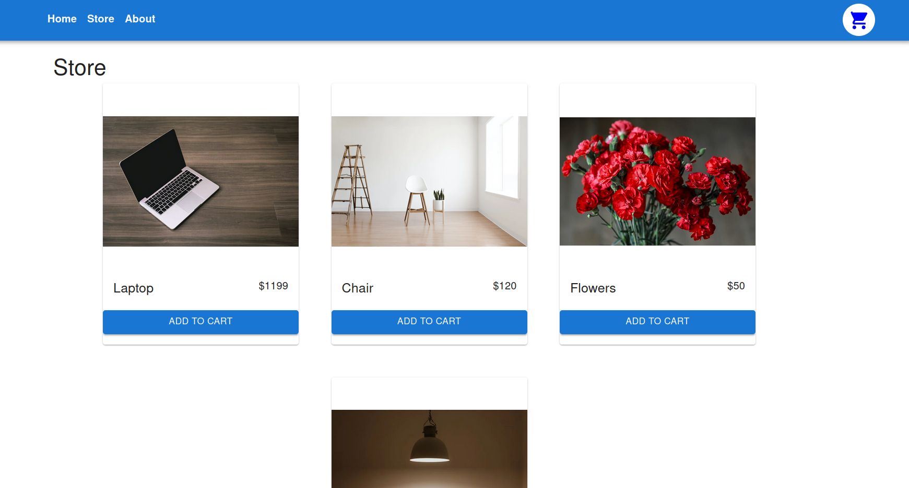

# Typescript Shopping Cart

This is a simple e-commerce application that was created using React to learn the following technologies

- Typescript
- React
- React router
- Context Api
- MUI

## Live webiste

Live website deployed on Netlify

https://shoppingcart-ts.netlify.app/store

## Getting Started

1. Clone repository

2. run `npm install` to download dependencies

3. run `npm start` to server the page on the server
